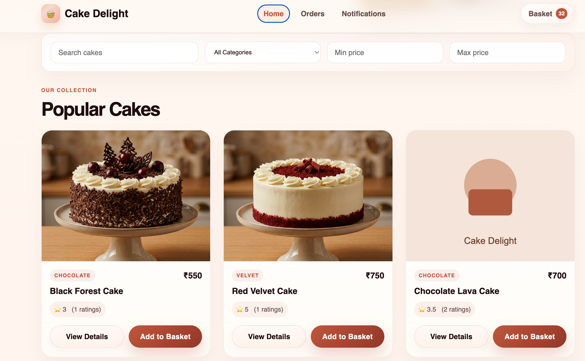
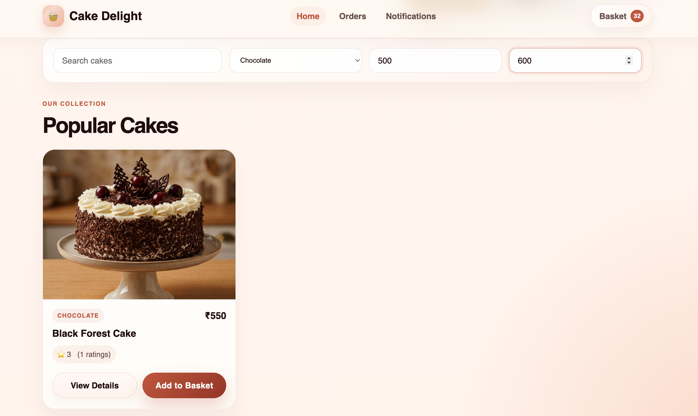
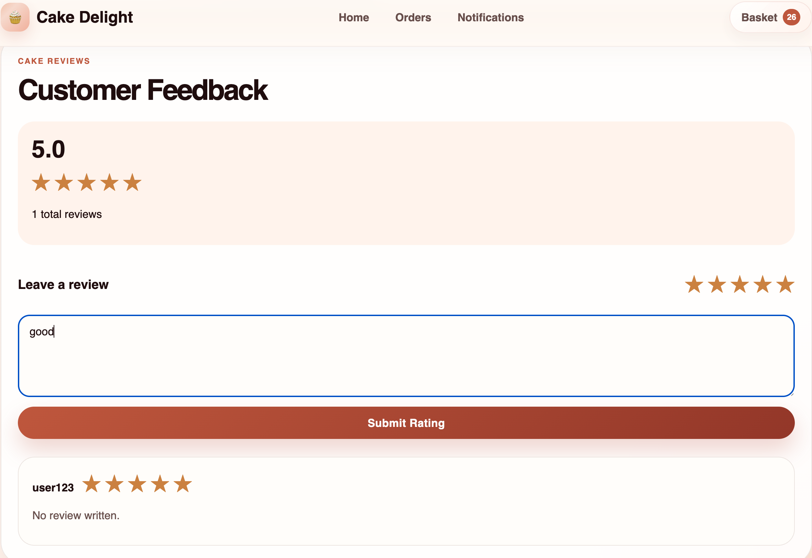
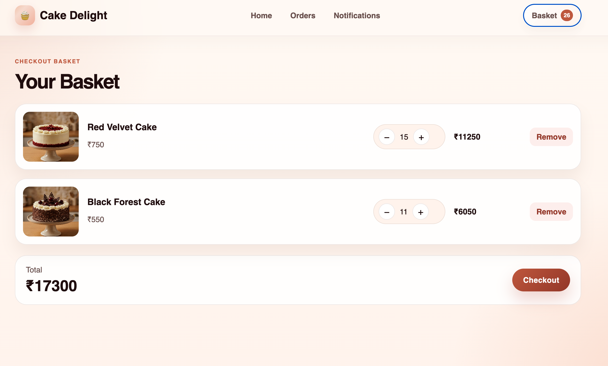
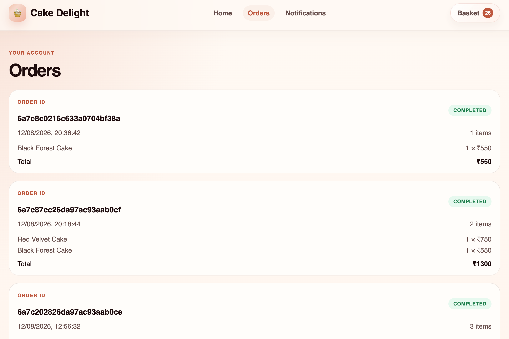
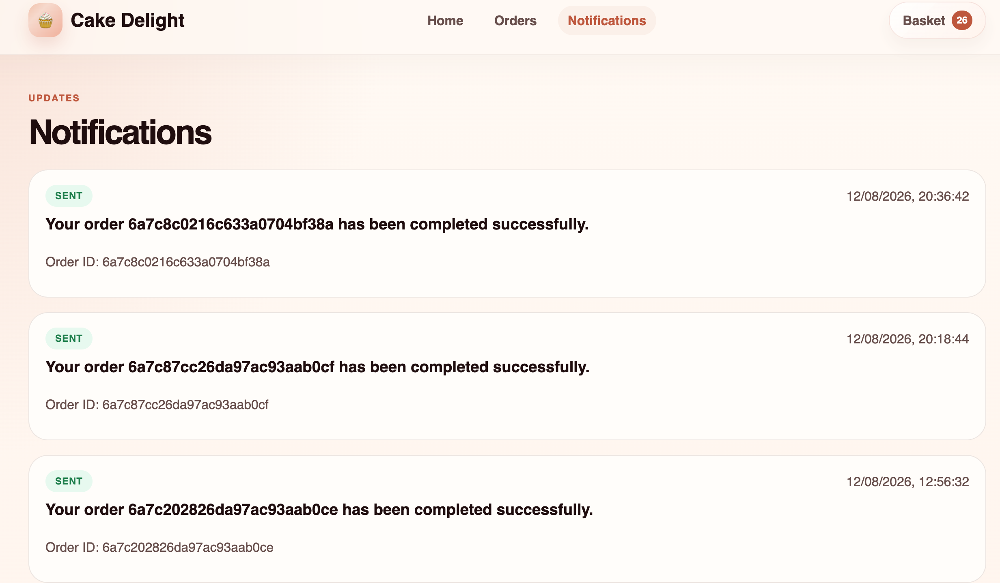

# Cake Delight

A cloud-native cake ordering application built with a microservices architecture.

## Overview

Cake Delight allows users to:

- browse cakes
- filter and search the catalog
- add items to a basket
- checkout and place orders
- view ratings and reviews
- receive notifications when an order is completed

This project demonstrates:

- Node.js + Express microservices
- MongoDB persistence
- RabbitMQ event-driven messaging
- Docker containerization
- Docker Compose for local orchestration
- Kubernetes deployment setup

---

## Architecture

The system is split into small services, each with a specific responsibility:

| Service | Responsibility | Port |
| --- | --- | ---: |
| Frontend | React UI served with Nginx | 5173 (local via Docker) |
| API Gateway | Routes requests to backend services | 3000 |
| Catalog Service | Cake catalog management | 3001 |
| Order Service | Basket and checkout logic | 3002 |
| Rating Service | Ratings and reviews | 3003 |
| Notification Service | Order notifications | 3004 |
| MongoDB | Persistent data store | 27017 |
| RabbitMQ | Async messaging / event publishing | 5672 |

### Request flow


Browser
  -> Frontend
  -> API Gateway
      -> Catalog Service / Order Service / Rating Service
      -> MongoDB

Order Service
  -> RabbitMQ
      -> Notification Service
          -> MongoDB


## Tech Stack

### Frontend
- React
- Axios
- Vite
- Nginx

### Backend
- Node.js
- Express.js
- REST APIs

### Data & Messaging
- MongoDB
- RabbitMQ

### DevOps
- Docker
- Docker Compose
- Kubernetes
- Kustomize

--------------------------------------------------------------------------------

## Quick Start

## DOCKER

### Prerequisites

- Docker Desktop installed and running
- Docker Compose available

### Start the app

From the project root:

```bash
docker compose up --build
```

Then open:

```text
http://localhost:5173
```

### Stop the app

```bash
docker compose down
```

> This stops the full stack without deleting the MongoDB data volume.

### Health checks

Each service exposes a basic `/health` endpoint and also includes a Docker `HEALTHCHECK` for runtime monitoring.

Examples:

```bash
curl http://localhost:3000/health
curl http://localhost:3001/health
curl http://localhost:3002/health
curl http://localhost:3003/health
curl http://localhost:3004/health
```

These endpoints confirm that the API gateway, catalog, order, rating, and notification services are running.

--------------------------------------------------------------------------------

## Kubernetes

### Prerequisites

- Docker Desktop with Kubernetes enabled
- kubectl installed

### Deploy to Kubernetes

```bash
docker compose build
kubectl apply -k k8s/
```

### Check status

```bash
kubectl get pods -n cake-delight
```

### Access the app

```text
http://localhost:30080
```

### Remove the deployment

```bash
kubectl delete namespace cake-delight
```

-----------------------------------------------------------------------------------

## Screenshots

### Cake Catalog


### Catalog Filtering


### Cake Rating


### Basket


### Checkout


### Order Confirmation



## Notes

- The frontend communicates with the API Gateway through the gateway route layer.
- Internal service communication within Kubernetes uses service names such as:
  - catalog-service
  - order-service
  - rating-service
  - notification-service
  - mongodb
  - rabbitmq

---

## Project Structure

```text
cake-delight/
├── api-gateway/
├── catalog-service/
├── order-service/
├── rating-service/
├── notification-service/
├── frontend/
├── k8s/
├── docker-compose.yml
├── README.md
```

---

## Summary

Cake Delight is a full-stack microservices project that combines catalog browsing, order processing, ratings, and notifications using modern backend patterns and container-based deployment. It is designed to showcase how independently deployed services can work together through REST APIs and asynchronous messaging.