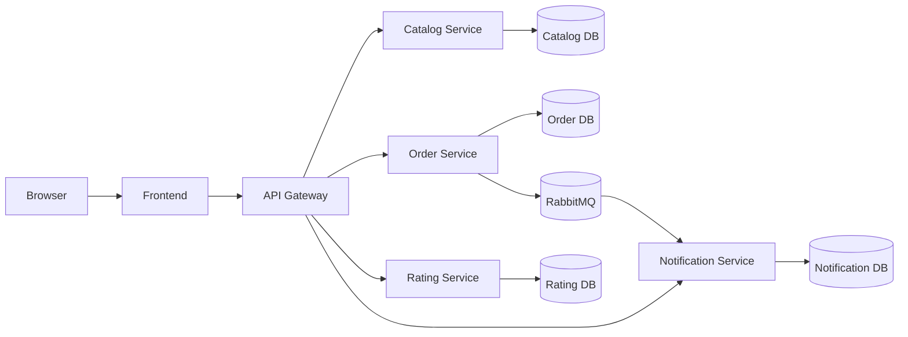

# Architecture

## Overview

The application follows a classic microservice architecture with a single frontend and multiple backend services. Each service is independently deployable and uses its own MongoDB database and explicit API boundaries.

## Service Responsibilities

### Frontend

The frontend is a React app built with Vite. It talks to the API gateway and renders the storefront, basket, rating, and notification features.

### API Gateway

The gateway sits in front of all backend services and exposes a unified API surface to the client. It is implemented in api-gateway/src/routes/gateway.routes.js and forwards requests by service.

### Catalog Service

The catalog service handles cake data such as name, category, price, availability, and image reference. It exposes CRUD routes under /api/cakes and includes filtering support for name, category, minPrice, and maxPrice.

### Order Service

The order service manages baskets and orders. It validates basket items against the catalog, calculates totals, stores basket state, and creates orders during checkout. It also publishes an order event to RabbitMQ.

### Rating Service

The rating service stores ratings by cakeId and userId and calculates averages for a cake. It does not directly call the catalog service when receiving ratings; it only stores the cakeId value.

### Notification Service

The notification service listens to RabbitMQ and stores notification entries for completed orders. It does not receive direct REST calls from the order service; it reacts to the event stream.

## Communication Patterns

### Synchronous Communication

The frontend and gateway use synchronous REST requests. The gateway forwards client requests to downstream services.

Examples:

- GET /api/cakes
- POST /api/baskets/:userId/items
- GET /api/ratings/cake/:cakeId/average
- GET /api/notifications/:userId

### Asynchronous Communication

The order service publishes an event to a RabbitMQ fanout exchange named cake_delight. The notification service binds a queue to this exchange and processes the event asynchronously.

This means the order flow is not blocked waiting for notification creation. The order request completes, then the notification service handles the new message independently.

## Deployment Topology

### Local Docker Compose

Docker Compose defines the following service relationships:

- frontend depends on api-gateway
- api-gateway depends on catalog, order, rating, and notification
- order service depends on catalog service and RabbitMQ
- rating, notification, and catalog services depend on MongoDB

Service-to-service URLs in Docker use container names such as:

- catalog-service
- order-service
- rating-service
- notification-service
- rabbitmq
- mongodb

### Kubernetes

The repository contains Kubernetes manifests under k8s/ with a namespace named cake-delight. These manifests define deployments and services for MongoDB, RabbitMQ, catalog, order, rating, notification, api-gateway, and frontend.

## Architectural Strengths

- Clear separation of concerns
- Easier independent scaling of services
- Simple local orchestration with Docker Compose
- Event-driven extension as a separate concern

## Architectural Limits

- No central configuration service
- No authentication or authorization
- No external API gateway security layer
- No observability stack
- No retry, dead-letter queue, or advanced RabbitMQ handling beyond the basic setup
- No direct validation of rating cakeId against catalog data
